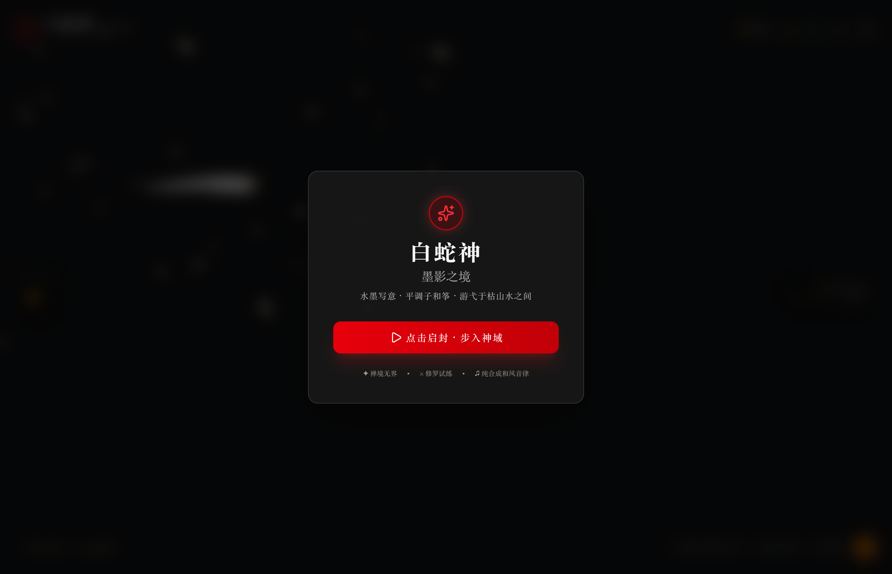
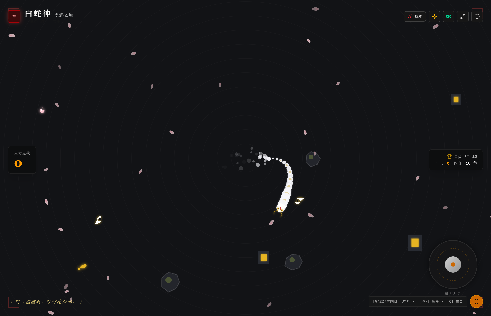
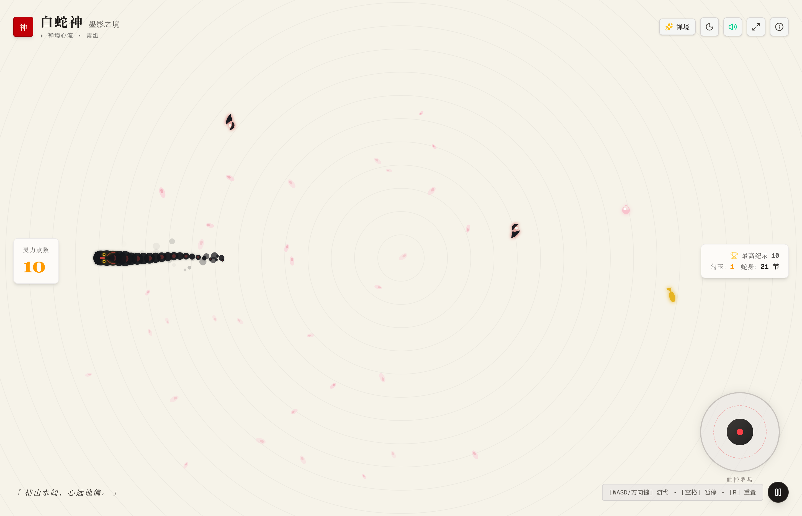
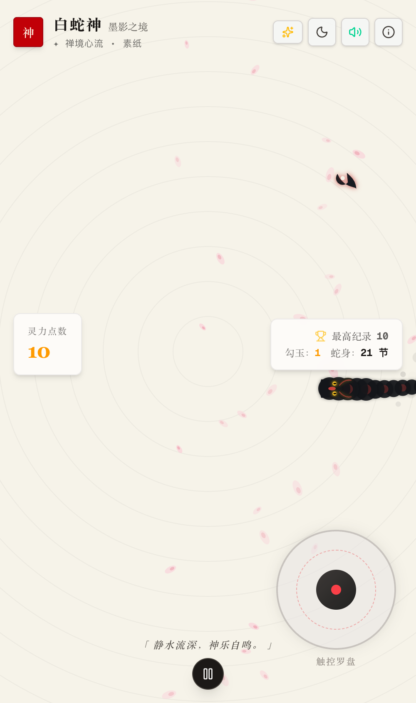

# 白蛇神：墨影之境 (Orochi Zen: The Ink Serpent)

> **世界级和风水墨贪吃蛇游戏**  
> 融汇水墨写意 (Sumi-e)、枯山水沙纹 (Karesansui)、平调子和筝音阶与连续骨骼动力学的东方美学游戏。

🌐 **在线演示 (Live Demo)**: [https://260908-orochi-zen-snake.vercel.app](https://260908-orochi-zen-snake.vercel.app)

---

## 视觉画卷 (Visual Showcase)

### 启封神域 (Landing)


### 玄墨深渊 (Sumi Dark Mode)


### 素纸和韵 (Washi Light Mode)


### 移动端与和风触控罗盘 (Mobile & Touch Compass)


---

## 核心特性 (Features)

1. **水墨写意美学 (Sumi-e & Japanese Aesthetics)**
   - **白蛇神形态**：抛弃传统方块像素，采用亚像素连续脊椎动力学与贝塞尔样条拟合，蛇身如狼毫毛笔浓淡渐变，额配朱印神纹，双目熠熠金光。
   - **枯山水与落樱**：背景蕴含动态同心波纹与微风中翻转飘零的八重樱花瓣，蛇行处墨滴微溅。
   - **和风双主题**：一键切换【玄墨深渊 (`#121316`)】与【素纸和韵 (`#F6F3E9`)】。

2. **精准双操控架构 (Dual Precision Control Architecture)**
   - **四向经典模式 (Cardinal 4-Way)**：
     - WASD / 方向键俐落换向；
     - **180° 反向锁死保护**：利用几何余弦严密拦截掉头自噬，彻底杜绝瞬间咬向自身颈部的恶性碰撞；
     - **极速转向缓冲队列 (Turn Queueing)**：支持高速连续按键（如右转后立刻下转）不丢键；
     - **零冲突自旋隔离**：彻底消除按键监听与帧循环微操偏转的逻辑冲突，告别无限打转。
   - **游弋舵向模式 (Analog Smooth Steering)**：
     - 360° 无极流线型游弋，适合追求心流冥想的平滑轨迹；
     - 键盘 A/D 或左右方向键施加恒定角速度偏转（按帧率 `dt` 物理自适应）。
   - **移动端与触控全适配**：
     - **全屏轻扫手势 (Canvas Swiping)**：手指在画布任意处滑动即可精准变向，支持单笔连拐；
     - **和风虚拟触控罗盘**：右下方半透明墨环罗盘，四向模式显示【北南西东】方位刻度与十字吸附，阻止误触穿透。

3. **零外部资源 Web Audio 纯代码合成器 (Zero-Asset Procedural Audio)**
   - **拍子木 (Hyoshigi)**：清脆双振荡木板击鸣，用于按键与启封。
   - **和筝 (Koto)**：基于日本平调子（Hirajoshi）五声音阶，每次吸纳勾玉弹奏阶梯流动的清澈拨弦。
   - **水琴窟 (Suikinkutsu)**：获取金鲤神魂时的深邃清冷水钟禅音。
   - **尺八 (Shakuhachi)**：触发“刹那”时缓时的悠远竹管空气泛音。
   - **太鼓 (Taiko)**：低频震撼共鸣打击。

4. **双重意境玩法 (Game Modes)**
   - **禅境模式 (Zen Flow)**：无边界死亡惩罚，穿屏越界如入水墨幻境，专注于心流舒缓与视觉治愈。
   - **修罗试练 (Trial)**：朱红鸟居神域结界封印，庭石与石灯笼四伏，速度递增，追求极盛连击与至高灵力。

5. **全端自适应响应式 (Responsive Design)**
   - 桌面端、平板 iPad 与移动端全屏无缝适配；
   - **无 Emoji 准则**：UI 控件 100% 采用定制高质量 SVG 矢量图标。

---

## 本地运行与测试 (Getting Started & Testing)

```bash
# 进入工程目录
cd Documents/A-coding/26.09.08-orochi-zen-snake

# 安装依赖
pnpm install

# 运行物理动力学与控制算法自动化测试
pnpm test

# 启动本地开发服务（专属端口 9438）
pnpm run dev

# 构建生产产物与验证
pnpm run build && pnpm run start
```

浏览器打开 `http://localhost:9438` 即可启封神域。

---

## 技术架构 (Architecture)

- **框架**：Next.js 16 (App Router) + React 19 + TypeScript
- **测试框架**：Vitest 自动化测试套件
- **渲染管线**：HTML5 Canvas (双缓冲，适配 Retina 2x/3x 高清 DPR，120FPS 动态物理)
- **音效管线**：Web Audio API 原生振荡器与滤波器链（零 MP3/WAV 加载延迟）
- **图标系统**：Lucide SVG 矢量图标
- **样式**：Tailwind CSS v4 + 和风古典配色变量

---

## 许可证 (License)

MIT License.

